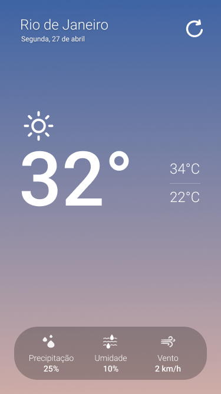
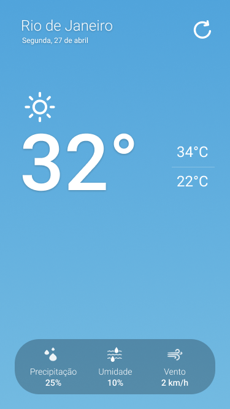
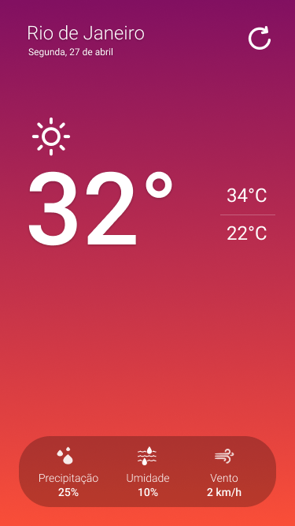
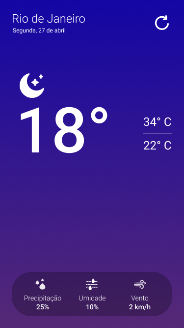

# WeatherNow

A basic app that display the weather of your current location.

## Screenshots

|                  Morning                   |                  Afternoon                   |                   Sunset                   |                  Night                   |
| :----------------------------------------: | :------------------------------------------: | :----------------------------------------: | :--------------------------------------: |
|  |  |  |  |

## Description

> The app uses the Geolocation API to get the user position (latitude and longitude) and the OpenWeatherApi to fetch the weather data.

## Disclaimer

> The app was only tested on an Iphone 13 Simulator, so there might be devices where the layout seems off.

## Getting Started

### Installing

- clone the project
- install the dependencies using yarn

```
yarn
```

- make sure to run pod install inside the ios folder

```
pod install
```

- create a .env file, you can use the .env.example as a guide
- navigate to https://openweathermap.org/api and sign up to generate an api key, once you've got it make sure to save it on the .env

that's it!

## Suggestions

> Feel free to open a PR/Issue or send me an email :)

## License

> This project is licensed under the GNU General Public License v3.0 License - see the LICENSE.md file for details
